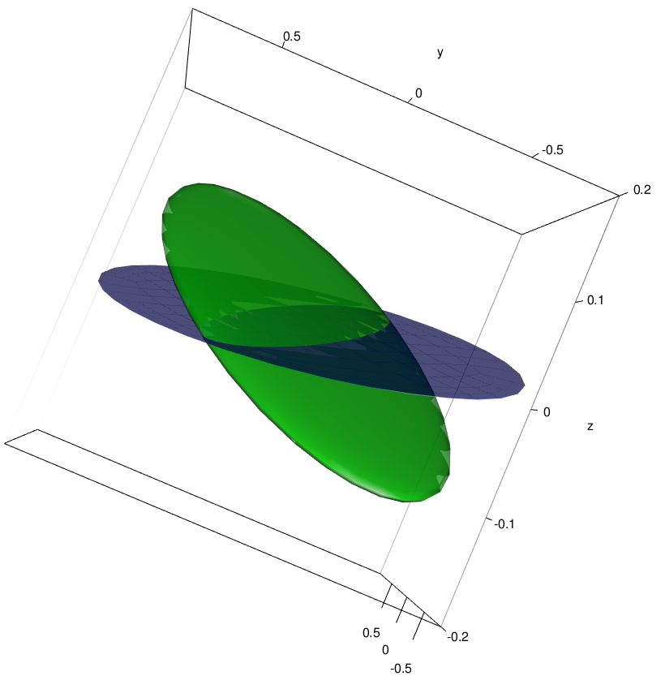
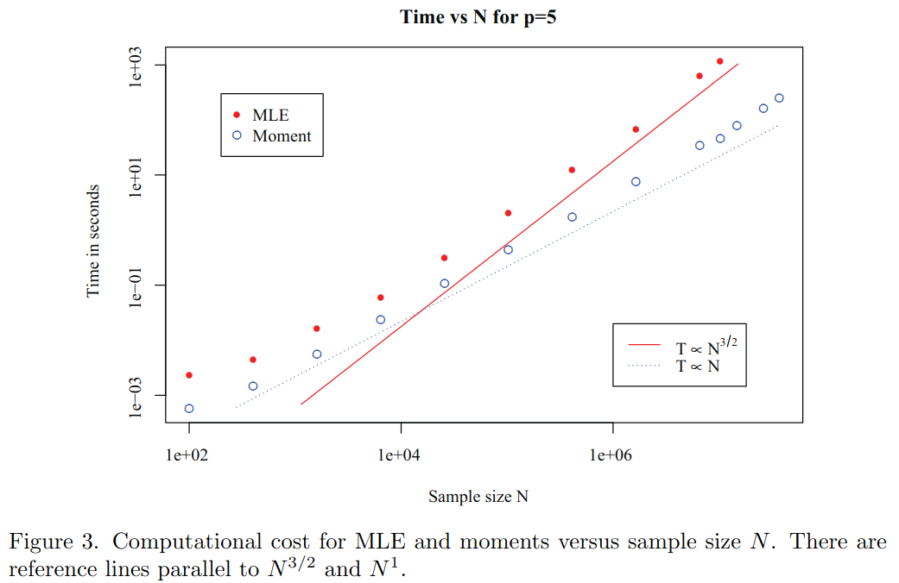

\newcommand{\bm}[1]{#1}

<style>
.refs {
   font-size: 16px;
}
h2 { 
 color: #3399ff;		
}
h3 { 
 color: #3399ff;		
}
.title-slide {
   background-color: #55bbff;
}
.small {
   font-size: 16px;
}

</style>
<!--    content: url(https://i.creativecommons.org/l/by-sa/4.0/88x31.png)
>
<!-- Limit image width and height -->
<style type="text/css">
img {     
  max-height: 560px;     
  max-width: 800px; 
}
</style>


<!-- https://stackoverflow.com/questions/46104530/table-of-contents-in-r-markdown-ioslides -->
<link rel="stylesheet" href="toc.css">

```{r knitr,include=FALSE, message = FALSE}
require("knitr")
knit_hooks$set(crop=hook_pdfcrop)
##opts_chunk$set(fig.width=5,fig.height=4,
##               out.width="0.6\\textwidth",
##               fig.align="center",echo=FALSE)
opts_chunk$set(echo=FALSE)
options(digits = 3)
```

```{r pkgs,message=FALSE}
library(lattice)
library(plotrix) ## for axis.break
library(reshape2)
library(ggplot2)
library(RColorBrewer)
library(lme4)
library(glmmTMB)
library(tidyverse)
library(MASS)
library(nlme)
library(grid)
zmargin <- theme(panel.spacing=unit(0,"lines"))
library(scales) ## for 'scientific', 'trans_format'
theme_set(theme_bw())
```

```{r setup, include=FALSE}
set.seed(20251028)
OkIt <- unname(palette.colors(n = 8, palette = "Okabe-Ito"))[-1]
scale_colour_discrete <- function(...) {
  scale_colour_manual(..., values=OkIt)
}
scale_fill_discrete <- function(...) {
  scale_fill_manual(..., values=OkIt)
}
```

## Table of contents

<div id="toc"></div>

# Inference details {.section}

## Confidence intervals/$p$-values

```{r inf-methods, echo=FALSE, crop = knitr::hook_pdfcrop}
dd <- data.frame(txt = c("Wald\napproximation",
                   "Likelihood ratio test/\nprofile CI",
                   "Bootstrapping/\nMCMC"),
                 x = 1:3,
                 y = rep(1,3))

dd2 <- data.frame(txt = c("fast,\ninaccurate",
                          "slow,\naccurate"),
                  x = c(1,3),
                  y = rep(1.02, 2))
ggplot(dd) + aes(x, y, label = txt) + geom_label() + lims(x=c(0,4), y=c(0.99, 1.1)) +
  annotate(geom = "segment",
           arrow = grid::arrow(angle = 30, length = unit(0.25, "inches"), ends = "both", type = "open"),
           x = 1, xend = 3, y = 1.01, yend = 1.01) +
  geom_text(data = dd2) +
  theme_void()
```

* easy methods work better as number of observations *and* number of clusters grow
* easy methods better for fixed effects than for RE variances

## Wald approximation: hypothesis tests

- assumes log-quadratic likelihood surface  
(exact for linear models)
- output of `summary()` (and `car::Anova()`, `afex::anova()`)
- contrasts/post-hoc tests: `emmeans`
- especially unreliable for random-effects (co)variances/correlations
- confidence intervals: `confint(., method = "Wald")` (fixed only)

```{r anova,results="hide",message=FALSE}
set.seed(20251108)
ss <- sleepstudy[sample(round(0.7*nrow(sleepstudy)), replace = FALSE),]
m1 <- lmer(Reaction ~ Days + (1+Days|Subject), ss)
car::Anova(m1)
```

```{r glmmTMB_fit, echo = FALSE}
m2 <- glmmTMB(Reaction ~ Days + (1+Days|Subject), ss, REML = TRUE)
```

## Degrees of freedom

- account for uncertainty in variance estimation ($Z$ vs $t$)
- matters when number of groups is 'small' (<50?)
- level-counting: `nlme::lme()`, `R/calcDenDF.R`
- `lmerTest`/`afex`; Satterthwaite:

```{r lmerTest, message=FALSE, echo = FALSE}
library(lmerTest)
printCoefmat(coef(summary(as_lmerModLmerTest(m1))), digits = 3, signif.stars = FALSE)
```

- Kenward-Roger: only applicable to REML fits (LMMs?); also adjusts variances

```{r lmerTest_kr, echo = FALSE}
printCoefmat(coef(summary(as_lmerModLmerTest(m1), ddf = "Kenward-Roger")), digits = 3, signif.stars = FALSE)
```

## Likelihood ratio test/profile confidence intervals

- individual parameters: `profile()`, `confint()`
- fit pairwise models and use `anova()` to compare
- `drop1`, `afex::anova()`

```{r ci, cache=TRUE, message = FALSE}
(ci1 <- confint(m1, oldNames = FALSE))
```

## Likelihood profiles

Why did `confint()` take so long?

```{r prof,cache=TRUE,echo=FALSE,fig.width=10}
pp <- as.data.frame(profile(m1, signames=FALSE)) |>
  transform(.par = factor(.par, levels = unique(.par)))

ci_data <- ci1 |>
  as.data.frame() |>
  setNames(c("lwr", "upr")) |>
  transform(.par = rownames(ci1))

ggplot(pp)+
  geom_point(mapping= aes(.focal,.zeta^2))+
  geom_line(mapping = aes(.focal,.zeta^2))+
  facet_wrap(~.par,scale="free_x")+
  labs(x="",y="negative log-likelihood") +
  geom_hline(data = ci_data, aes(yintercept  = 3.84), lty = 2, colour = "red") +
  geom_rect(data = ci_data, aes(xmin = lwr, xmax = upr, ymin = -Inf, ymax = Inf),  fill = "blue",
            colour = NA, alpha = 0.4)
```

## Likelihood ratio tests of variances are problematic

* theory of LRT fails when $H_0$ is "on the boundary"
* e.g. testing whether variance is 0
* simplest cases, conservative ($p$-vals are 2X nominal)
* do you really need to hypothesis-test random effects?
* bootstrapping ...

## Bootstrap 

* @thaicomparison2013
* *nonparametric*: resampling with replacement (`lmeresampler` package)
* straightforward for nested models
* hard for crossed models: *nonparametric* bootstrapping
   * simulate from fitted model, refit, extract estimates
   * `confint(., method = "boot")`, `bootMer()`, `pbkrtest` package
* slow! (some methods are parallelized)
* estimate CIs on any quantity, e.g. ratios of variances

## Predictive simulation

- `simulate()` new data from fitted model
- parameters fixed at best estimates (unlike nonpar bootstrap)
- can either use 'estimated' conditional modes or draw new random values
- does *not* include parameter uncertainty

```{r pps}

```

# Troubleshooting {.section}

## What is a "singular fit"? {.columns-2}

* non-positive-definite covariance matrix
* zero variance (simple case)
* ±1 correlation (next simplest case)
* hard to recognize in the general case! 
* some linear combination(s) of random-effect variables have zero variance

```{r rgl_sing3d, eval = FALSE, echo = FALSE}
## slightly hacky example derived from fire model
dd <- readRDS("data/ecoreg.rds")
set.seed(20251108)
dds <- dd[sample(nrow(dd), size = round(nrow(dd)*0.7), replace = FALSE), ]
m_full <- lmer(mmamm_log ~ 1 + (0 + Feat_cv_sc + NPP_cv_sc + area_km2_log_sc | flor_realms), data = dd)
m_sing <- lmer(mmamm_log ~ 1 + (0 + Feat_cv_sc + NPP_cv_sc + area_km2_log_sc | flor_realms), data = dds)

library(rgl)
open3d()
vc <- Matrix::nearPD(VarCorr(m_sing)[[1]])$mat |> as.matrix()
vc_full <- as.matrix(VarCorr(m_full)[[1]])
lims <- c(-0.6, 0.6)
plot3d(ellipse3d(vc), xlim = lims, ylim = lims, zlim = c(-0.2, 0.2), col = "blue", alpha = 0.7)
plot3d(ellipse3d(vc_full), col = "green", add = TRUE, alpha = 0.7)
rgl.snapshot("pix/sing3d.png")
```

```{r}

```

## Why are fits singular?

Essentially, because the *observed* among-group variation is less than
the *expected* among-group variation $ = \sigma^2_{\textrm{among}} + 
\frac{\sigma^2_{\textrm{within}}}{n}$. More generally, because *some* dimension
of the variance-covariance matrix has zero extent ...

```{r singsims,echo=FALSE,fig.width=7,fig.height=4,cache=TRUE,message=FALSE,warning=FALSE}
simfun <- function(n1=5,n2=5,sd1=1,sd2=1) {
  d <- expand.grid(f1=factor(seq(n1)),f2=factor(seq(n2)))
  u1 <- rnorm(n1,sd=sd1)
  d$y <- rnorm(n1*n2,mean=u1,sd=sd2)
  d
}
require(lme4)
fitfun <- function(d=simfun()) {
  sqrt(unlist(VarCorr(lmer(y~(1|f1),data=d))))
}
set.seed(101)
sd_dist1 <- replicate(500,fitfun())
sd_dist2 <- replicate(500,fitfun(simfun(n1=3)))
sd_List <- list(n1.5=sd_dist1,n1.3=sd_dist2)
plotfun <- function(x,trueval,main="") {
  par(las=1,bty="l")
  hist(x,breaks=50,col="gray",main=main,xlab="est. sd",
       freq=FALSE)
}
par(mfrow=c(1,2))
plotfun(sd_List[[1]],main="sd=1,res.sd=1,5 groups")
plotfun(sd_List[[2]],main="sd=1,res.sd=1,3 groups")
invisible(dev.off())
```

## What to do about singular fits?

* ignore them, or drop terms
* switch from random to fixed effects
* regularize/add priors
* simplify the model
* full Bayesian treatment

## Ignoring/dropping terms

* Zero variances/singular fits *are not a mistake*; they're the best fit to the data
* Dropping a (full) singular term gives the same results/predictions/etc.
    * It does narrow confidence intervals (if using profile CIs)

## Switch from random to fixed effects

- especially for top-level clusters with few levels
- admit you can't estimate the variance (RE variance $\to \infty$)
    - more conservative than dropping/pooling (RE variance = 0)
- e.g. *Arabidopsis*: region (3) / population (9) / genotype (24), use `~ reg + (1|(reg:population)/genotype)`

## Regularize/add priors

* Bayesians don't care about singular fits  
(they look at the whole posterior distribution, not just the MLE/mode)
* quasi-Bayesian approach: *regularize*
* add a penalty (== prior) to keep estimates away from zero/boundaries
* @chung_nondegenerate_2013: add a weak prior that prevents singularity
* `blme`, `glmmTMB` packages
* useful in other cases (complete separation in logistic models)

## Simplifying random effect terms

* drop some varying effects 
   * e.g. random intercepts and slopes → random intercepts only
* set correlations among parameters to zero (diagonal covariance matrix)
* set all correlations among parameters equal (*compound symmetric* model)
* *reduced rank* models

## Simplifying covariance matrices

* Suppose factor `f` (5 levels) varies within groups `g`
* `(1+f|g)`: $(n(n+1))/2 = (5\times 6)/2 = 15$ parameters)

$$
\newcommand{\oneentryone}{\sigma^2_{\{\scriptscriptstyle g|1\}}}
\newcommand{\oneentry}[1]{\sigma^2_{\{\scriptscriptstyle g|f_{#1}\}}}
\newcommand{\twoentry}[2]{\sigma_{\scriptscriptstyle \{g|f_{#1}\},\{g|f_{#2}\}}}
\newcommand{\twoentryone}[1]{\sigma_{\scriptscriptstyle \{g|1\},\{g|f_{#1}\}}}
\left[
  \begin{array}{ccccc}
    \oneentryone & . & . & . & . \\
    \twoentryone{21} & \oneentry{21} & . & . & . \\
    \twoentryone{31} & \twoentry{21}{31} & \oneentry{31} & . & . \\
    \twoentryone{41} & \twoentry{21}{41} & \twoentry{31}{41} & \oneentry{41} & . \\
    \twoentryone{51} & \twoentry{21}{51} & \twoentry{31}{51} & \twoentry{41}{51} & \oneentry{51}
\end{array}
\right]
$$

## Sum-to-zero contrasts

* change from *treatment* to *sum-to-zero* contrasts
* coefficients are means of each level, not baseline/differences from baseline

$$
\left[
  \begin{array}{ccccc}
    \oneentry{1} & . & . & . & . \\
    \twoentry{1}{2} & \oneentry{2} & . & . & . \\
    \twoentry{1}{3} & \twoentry{2}{3} & \oneentry{3} & . & . \\
    \twoentry{1}{4} & \twoentry{2}{4} & \twoentry{3}{4} & \oneentry{4} & . \\
    \twoentry{1}{5} & \twoentry{2}{5} & \twoentry{3}{5} & \twoentry{4}{5} & \oneentry{5}
\end{array}
\right]
$$

## Complex random intercepts [@scandolaReliability2024a]


* replace `(1+f|g)` with `(1|g/f)`

$$
\Sigma = \left[
\begin{array}{ccccc}
\sigma^2 & . & . & . & . \\
\rho \sigma^2 & \sigma^2 & . & . & . \\
\rho \sigma^2 & \rho \sigma^2 & \sigma^2 & . & .  \\
\rho \sigma^2 & \rho \sigma^2 & \rho \sigma^2 & \sigma^2 & .  \\
\rho \sigma^2 & \rho \sigma^2 & \rho \sigma^2 & \rho \sigma^2 & \sigma^2 
\end{array}
\right]
$$

* where $\sigma^2 = \sigma^2_{f}+\sigma^2_{g}$, $\rho = \frac{\sigma^2_{g}}{\sigma^2}$
* $\rho>0$; all variances identical
* *compound symmetry*: `cs()` (`glmmTMB`), `corCompSymm` (`nlme`)

## Diagonal covariance matrices

- `(1+x+y+z||b)` or `diag(1+x+y+z|b)`
     - or `(1|b) + (0+x|b) + ...`
- `lme4` version **only works properly for continuous predictors**
- `afex::mixed` can do this
- contrasts/centering matters!
- $n$ instead of $n(n+1)/2$ parameters

## Reduced-rank covariance matrices

* 'factor analytic' or 'reduced rank'
* $d$-dimensional covariance matrix in a $p$-dimensional space
* $\Sigma = \Lambda D \Lambda^\top$ ($\Lambda$ is the *factor loading matrix*)
* $d \cdot p - \frac{d(d-1)}{2}$ parameters (linear in $p$)
* available in R: `glmmTMB`, `sommer`, `lme4breeding`: ASReml

## Convergence failures 

- convergence failures are common
- what do they really mean? how to fix them? when can they be ignored?
- **approximate** test that gradient=0 and curvature is correct
- scale and center predictors; simplify model
- use `?allFit` to see whether different optimizers give sufficiently similar answers
     - `$fixef`, etc.: are answers sufficiently similar?
     - `$llik`: how similar is goodness-of-fit?

```{r allFit_ex, cache=TRUE, message=FALSE, echo = FALSE, eval = FALSE}
m1 <- lmer(Reaction ~ Days + (Days|Subject), sleepstudy)
aa <- allFit(m1)
ss <- summary(aa)
names(ss)
ss$fixef
```

```{r allFit_more, echo = FALSE, eval = FALSE}
ss$sdcor
ss$llik-min(ss$llik)
```

## Which model to use?

- @barr_random_2013: "keep it maximal"; reduce until no more convergence failures
- @bates_parsimonious_2015, @matuschek_balancing_2017: more parsimony
- R. Kliegl: best non-singular
    * make singular terms diagonal
	* drop elements with small variances
	* try full (unstructured) model with only these elements
- brute-force: non-singular, best AIC [@moritzrole2023a]
- inspect principal components of covariance matrix? (`rePCA`)

# Structured covariances {.section}

## Spatial/temporal

* AR1 (autoregressive order-1): correlations $\rho$, $\rho^2$, $\rho^3$ ... for lagged pairs in space/time
* irregular time/1D space: Ornstein-Uhlenbeck/CAR1 ($\rho = \phi^{-\Delta t}$)
* geostatistical (Gaussian-process) correlation models: exponential, Matérn ...
* `glmmTMB`, `mgcv`, `INLA`, `spaMM`

## Smooth terms

* can use mixed-model/latent-variable frameworks to fit smooth *functional* terms
* additive models (penalized regression): add penalty $\sigma^2 b S b^\top$
* exactly equivalent to the random-effects component in a mixed model
* @wahbaSplineModelsObservational1990; @wood_generalized_2017; @hefleyBasis2017; @pedersenHierarchical2018
* `mgcv`, `gamm4`, `glmmTMB`

## 'Old' and 'new' random effects [@hodges_richly_2016]

* do random effects/latent variables represent differences among exchangeable groups ...
* ... or spatial/temporal/functional structure? [@wood_generalized_2017]
* prediction/inference: population level or the cluster level [@vaida_conditional_2005] ?
* counting parameters?

## 

```{r out.width = "100%"}
knitr::include_graphics("pix/ab1mvs.jpg")
```

# Big data? {.section}

## The need for speed 

<!-- https://tex.stackexchange.com/questions/250623/how-to-generate-a-4-up-table-of-images-with-pandoc -->

@brooks_modeling_2017 (negative binomial model)


## more speed


 
## Julia/R benchmark

* Poisson model, 98K rows/151 groups [@markwickFittingMixedEffects2022]

```{r markwick_bench, echo = FALSE}
benchdat <- read.table(header = TRUE, sep = "|", text = "
Language | param | Mean  | Median  | Min  | Max
Julia |   |11.151  | 10.966  | 9.963  | 16.150
Julia  | fast=true  | 5.94  | 5.924  | 4.98  | 8.15
R  |   | 35.4  | 33.12  | 24.33  | 66.48
R  | nAGQ=0  | 8.06  | 7.99  | 7.37  | 9.56
") |>
  dplyr::mutate(param = trimws(param),
                Language = trimws(Language),
                method = paste(Language, ifelse(param == "", "", sprintf("(%s)", param)))) |>
  dplyr::mutate(method = factor(method, levels = method))
ggplot(benchdat, aes(y = method)) +
  geom_linerange(aes(xmin=Min, xmax = Max)) +
  geom_point(aes(x=Mean)) +
  geom_point(aes(x=Median), pch = 23) +
  scale_x_log10() +
  labs (y = "", x = "Time (seconds)") +
  theme_bw(base_size=20)
```

## Scalable mixed models

* @gaoEstimationInferenceVery2020; @ghoshScalableLogisticRegression2022; @bellioConsistentScalableComposite2025
* ${\cal O}(N)$ methods (`lme4` etc. are ${\cal O}(N^{3/2})$)
* StitchFix data: 5M observations, 6.3K items, 762K clients

```{r}

```

# Challenges and open questions {.section}

## On beyond `lme4`

- `glmmTMB`: zero-inflation, weird conditional distributions
- `MCMCglmm`, `brms`,`rstanarm`: Bayesian
- `gllvm`: multivariate ecological/phylogenetic data
- `INLA`: great for spatial and temporal structures
- [rethinking package](https://github.com/rmcelreath/rethinking)

## Toolboxes

- JAGS (R: `rjags`, `r2jags`)
- TensorFlow (R: `greta`)
- NIMBLE (R: `nimble` package)
- Stan (R: `rstan`)
- TMB (R: `TMB`, `RTMB`)

## On beyond R {.columns-2}

- Julia: `MixedModels.jl`
- SAS: PROC MIXED, NLMIXED
- AS-Reml
- Stata (GLLAMM, xtmelogit)
- HLM, MLWiN
- Python? (`pymer4`, `statsmodels`)

```{r zebra, out.width="50%"}
knitr::include_graphics("pix/300px-On_Beyond_Zebra.jpg")
```

## Package comparison {.small}

| Capability | lme4 | GLMMadaptive | glmmTMB | mgcv | nlme | glmmrBase |
|------------|------|--------------|---------|------|------|------------|
| Linear mixed models | ✅ | ❌ | ✅ | ✅ | ✅ | ✅ |
| GLMMs | ✅ | ✅ | ✅ | ⚠️ | ❌ | ✅ |
| Laplace approximation | ✅ | ❌ | ✅ | ✅ (PQL) | ✅ | ✅ |
| Gauss–Hermite quadrature | ✅ (limited) | ✅ | ❌ | ❌ | ❌ | ❌ |
| Structured covariance (CS/AR1/etc.) | ⚠️ | ❌ | ✅ | ✅ | ✅ | ✅ |
| Space/time covariance | ❌ | ❌ | ✅ | ⚠️ | ✅ | ✅ |
| Heteroscedasticity | ❌ | ⚠️ | ✅ | ⚠️ | ✅ | ✅ |

## Challenges

- Small clusters: need AGQ/MCMC
- Small numbers of clusters: need finite-size corrections
- Small data sets: singular fits, model selection
- Ever-expanding (desired) feature matrix; downstream ecosystems
- Big data: speed!

<style>
slides > slide { overflow: scroll; }
slides > slide:not(.nobackground):after {
  content: '';
}
</style>

## references  {.refs}

::: {#refs}
:::

# extras

## $R^2$

* goodness-of-fit measures for LMMs, and for GLMMs, are hard
* meanings of $R^2$ (variance explained; $\textrm{corr}(\textrm{obs}, \textrm{predicted})^2$; etc. don't coincide
* *pseudo*-$R^2$ for GLMs (MacFadden, Nagelkerke, etc.)
* various  [@jaeger_r2_2017
* Nakagawa/Schielzeth/Johnson most popular [@nakagawa_general_2013; @johnson_extension_2014; @nakagawa_coefficient_2017]
* (?but what about zero-inflation, new distributions, etc. etc. etc.)

## Overdispersion

* "too much" variability (relative to theoretical expectation)
* very serious for fixed-dispersion families (Poisson, binomial)
* conjugate-family distributions (negative binomial, Beta-binomial)
* observation-level random effects [@elston_analysis_2001; @harrison_using_2014; @harrison_comparison_2015]
* unidentifiable for binary data (unless groupable)
* not much concern for families with estimated scale/dispersion (but see @hilbe_overdispersion_2011)

## Zero-inflation

* "many zeros does not mean zero-inflation" [@warton_many_2005]
* can't use Vuong test [@wilsonMisuse2015a; @heTest2019]
* `glmmTMB` or use expectation-maximization (see [here](https://stats.stackexchange.com/q/208829/2126))
* `DHARMa` can test by simulation

## Causal inference

* I don't go there very much
* Solve many issues by adding *group mean* as a covariate [@byrnes_causal_2025]
* Awareness of *general* causal issues: DAGs, mediation/confounding, etc.. [@mcelreath_statistical_2015; @franks_ecology_2025]
